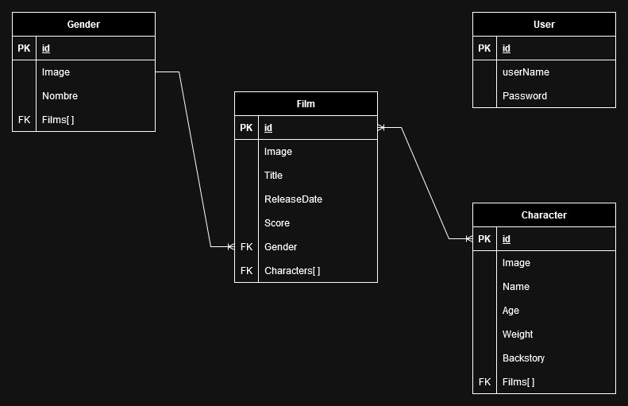

# Films Management - NodeJs
## Project Introduction
### The Biz-Nation Technical Assessment
In this test we aim to develop an API to explore the system given by knowing and modifying the characters that compose it and understanding which movies have participated. On the other hand, you will need to expose the information so that any frontend can consume it using a MVC model with REST structure.
### Technologies
- **Database**: MySQL
- **BackEnd**: NodeJs with Express(Framework) + Sequelize(ORM)
- **Documentation**: Swagger
- **Auth Methodology**: JWT
- **Platform**: Docker (App & DB)

## Entity Relation Diagram
<div style="width: 70%; margin: 0 auto;">
    
</div>
With this in mind we have to take into account the relations and its types, looking for a solution "Code First" to resolve OneToMany and ManyToMany relations as we have in this case.

The User entity is isolated because is used only for the Auth of the person who is interacting with the API.

## Step By Step API building
Here you could find the exact steps I follow to approach this challenge until we get the closest to the initial requierment.

### Project Initializing
First that all, and using the terminal I created the project directory an initialized two elements. The NPM (using the -y flag to a default project) format and the GIT repository.
``` bash
$ cd <personalProjects>
$ mkdir films-management

$ cd films-management
$ npm init -y
$ git init
```
After it and inside the code editor, the general config file were needed, as follows:
- `readme.md` to store all the process info.
- `.gitignore` to store the files that won't be part of the tracking (https://www.toptal.com/developers/gitignore/).
- `.eslintrc.json` to store the good practice for coding and ES6 standars.
- `.editorconfig` to store the coding config for any developer who enters the project (https://editorconfig.org).
- `index.js` file where the main entrypoint of the app is build.
- `docs_assets` a folder to store images or other assets to insert in this documentation.

Now that this files are created and filled with general recomendations of the NPM and GIT community I prefer to add some task to the `package.json` at the script section so a dev environment (*nodemon*) can be executed, the start mode could be called and the lint could be used with those.

``` json
  "scripts": {
    "test": "echo \"Error: no test specified\" && exit 1",
    "dev": "nodemon index.js",
    "start": "node index.js",
    "lint": "eslint"
  },
```
For this to work some dependencies have to be installed using the -D flag (Development Dependencies) as follows:
``` bash
$ npm i nodemon eslint eslint-config-prettier eslint-plugin-prettier prettier -D
```
Now its time to install Express to create the app server, this time without the flag, meaning that is a production dependency.
``` bash
$ npm i express
```
With our main dependency installed, is just time to create a basic Express structure and the initial route to the project, in this way we could see that the app is well configurated and working OK.
``` js
  const express = require("express");
  const app = express();
  const port = 3000;

  app.get("/", (req, res) =>{
    res.send("Welcome to Disney Films Manager for BizNation");
  });

  app.listen(port, () =>{
    console.log("App running on port: " + port);
  });
```
### Project Structure
As the challenge mention, this app is an API which use REST verbs to comunicate with the client, thats why its going to be mixed with the solid principles and generate a layer model with the following sections:
- **Routes**: containing the routing of the app and also the controlers with the REST verbs implementation. For this project the naming for the routing files will be `<entity>.router.js`.
- **Services**: To establish the business logic and repositories interaction. For this project the naming for the service files will be `<entity>.service.js`.
- **Middlewares**: Interceptors that allows the handling of special cases as global errors, auths and others. For this project the naming for the service files will be `<entity>.handler.js` adding a library called `Boom` to manage the error types and `Joi` to data schema validation.
  ``` bash
  $ npm i @hapi/boom
  $ npm i joi
  ```
- 


CORS Usage
whitelis and options callback


Docker
cración del archivo docker-compose con mysql
incluir el nombre de la carpeta de DB dentro del git ignore

Conexión node-mysql
driver de npm

npm i dotenv
